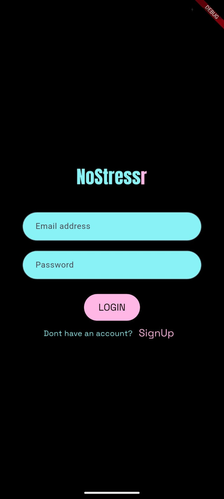
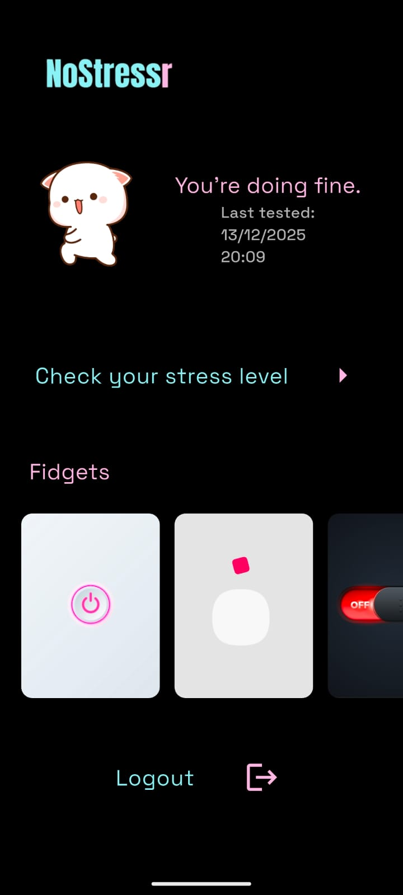
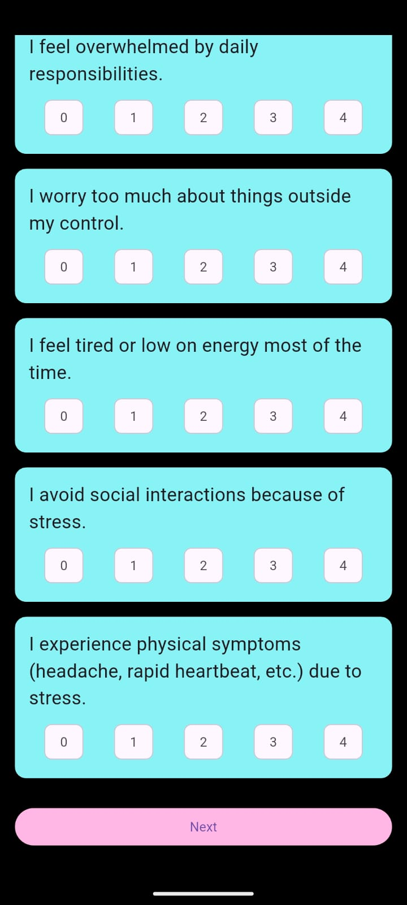

# Nostressr

Nostressr is a stress assessment and relief application built using **Flutter**.  
It combines relaxation tools with interactive **fidget-based** features to help users reduce and manage stress effectively.

---

## ✨ Features

- 🧠 **Stress Assessment**
  - Evaluate current stress levels through quick assessments.

- 🎯 **Stress Relief Fidget Toys**
  - Click Switch  
  - On/Off Switch  
  - Funny Button  
  - (More interactive toys coming soon!)

- 🎨 **Smooth & Realistic Animations**
  - Built using **Rive animations** for an immersive tactile experience.

---

## 📱 App Screenshots (Preview)

> Replace the filenames with your actual images once uploaded

| Splash Screen | Login Screen | Home Screen | Stress Assessment |
|-----------------|-----------------|-----------------|-----------------|
|  |  |  |  |

| Fidget Toy – Click Switch | On/Off Switch | Funny Button |
|---------------------------|---------------|--------------|
| [](assets/screens/click.mp4) | [](assets/videos/onoff.mp4) | [](assets/videos/funnybutton.mp4) |


---

## 🛠️ Tech Stack

- **Flutter**
- **Dart**
- **Rive animations**
- **Firebase**

---
## 📥 Download

You can try the app by downloading the APK below:

🔹 [Download APK (v1.0.0)](https://github.com/SpaceOfAbhi/NoStressr/releases/tag/v1.0.0)

> ⚠️ Enable “Install from Unknown Sources” on your Android device.
---

## 🚀 Getting Started

```bash
# Clone the repository
git clone <repo-link>

# Go into the project folder
cd nostressr

# Install dependencies
flutter pub get

# Run the app
flutter run

